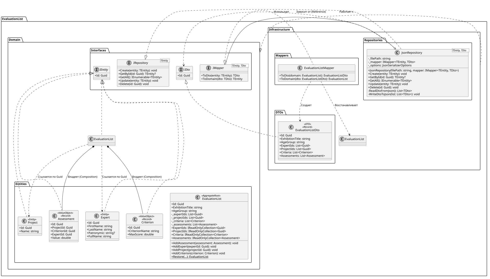

# EvaluationList (Система оценки выставочных проектов)



Проект предназначен для управления процессом оценки проектов на выставках. Разработка ведется с применением подходов **Domain-Driven Design (DDD)** и **Слоистой архитектуры**.

## Структура проекта

* **`EvaluationList.Domain`**: Ядро бизнес-логики. Содержит корень агрегации `EvaluationList`, который контролирует правила добавления оценок. Сущности обладают строгой валидацией (например, проверка ФИО у `Expert`). Не имеет внешних зависимостей.
* **`EvaluationList.Infrastructure`**: Слой доступа к данным. Реализует обобщенный `JsonRepository` для сохранения состояния приложения. Для изоляции домена используется паттерн Mapper и DTO-объекты.
* **`Evaluation.Tests`**: Модульные тесты бизнес-логики на базе xUnit.

## ⚙️ Основные методы EvaluationList

| Метод | Параметры | Описание | Исключения |
| :--- | :--- | :--- | :--- |
| `AddCriterion` | `Criterion criterion` | Добавляет новый критерий оценивания | - |
| `AddAssessment` | `Assessment assessment` | Фиксирует оценку эксперта за проект | `InvalidOperationException`, `ArgumentException` |


##  Примеры использования

### Создание участников и критериев
```csharp
var expert = new Expert
{
    FirstName = "Иван",
    LastName = "Иванов"
};

var criterion = new Criterion
{
    CriterionName = "Техническая реализация",
    MaxScore = 10.0
};
