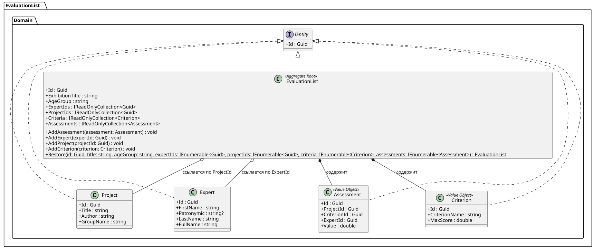
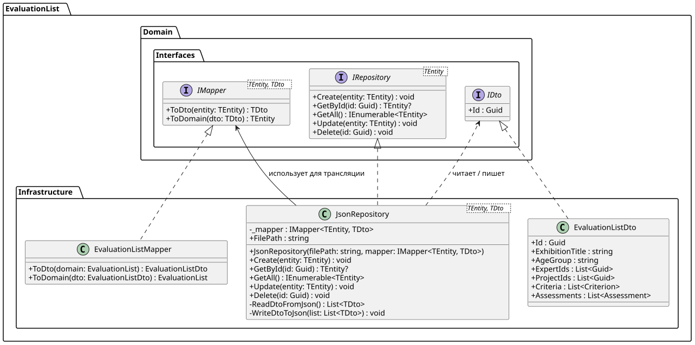

# EvaluationList (Система оценки выставочных проектов)


## Domain 

## Infrastructure 

**EvaluationList** — это .NET библиотека, предоставляющая готовое доменное ядро и инфраструктуру для управления процессом оценки проектов на выставках, хакатонах и других конкурсных мероприятиях. 

Библиотека спроектирована в соответствии с принципами **Onion Architecture** (Слоистая Архитектура), обеспечивая строгую инкапсуляцию бизнес-правил, независимость от базы данных и высокую тестируемость.

---

##  Архитектура проекта

Проект разделен на три основных слоя:

1. **`EvaluationList.Domain`**: Сердце приложения. Содержит бизнес-логику, правила валидации, сущности (`Expert`, `Project`), объекты-значения (`Criterion`, `Assessment`) и корень агрегации (`EvaluationList`). Сущности генерируют упорядоченные идентификаторы через `Guid.CreateVersion7()`. Не имеет внешних зависимостей.
2. **`EvaluationList.Infrastructure`**: Слой доступа к данным. Отвечает за сохранение состояния доменных моделей в JSON-файлы. Реализует паттерны **Repository** (`JsonRepository`) и **Mapper** для трансляции доменных объектов в DTO.
3. **`Evaluation.Tests` / `EvaluationList.Infrastructure.Test`**: Модульные тесты бизнес-логики и механизмов хранения на базе фреймворка **xUnit**.

---

##  Требования

* **Платформа:** .NET 10.0+
* **Язык:** C# 13 (используются фичи `field` keywords, `required` modifiers, `init` properties).

---

##  Основные компоненты (API)

### Корень агрегации: `EvaluationList`
Управляет всем процессом выставления оценок в рамках одного мероприятия. Связывает участников и жюри по их `Id`.

| Метод | Параметры | Описание | Исключения |
| :--- | :--- | :--- | :--- |
| `AddCriterion` | `Criterion criterion` | Добавляет новый критерий оценивания в лист. | - |
| `AddExpert` | `Guid expertId` | Привязывает эксперта к листу по его ID. | - |
| `AddProject` | `Guid projectId` | Привязывает проект участника к листу по его ID. | - |
| `AddAssessment` | `Assessment assessment` | Фиксирует оценку эксперта за проект по критерию. | `InvalidOperationException` (критерий не найден);<br>`ArgumentException` (оценка превышает максимум). |

### Репозиторий: `JsonRepository<TEntity, TDto>`
Обобщенный репозиторий для CRUD-операций.

| Метод | Параметры | Возвращает | Описание |
| :--- | :--- | :--- | :--- |
| `Create` | `TEntity entity` | `void` | Сериализует и сохраняет новую сущность в файл. |
| `GetById` | `Guid id` | `TEntity?` | Возвращает сущность по ID или `null`. |
| `GetAll` | - | `IEnumerable<TEntity>`| Возвращает коллекцию всех сохраненных сущностей. |
| `Update` | `TEntity entity` | `void` | Обновляет данные существующей сущности по её ID. |
| `Delete` | `Guid id` | `void` | Удаляет сущность из файла по её ID. |

---

## Примеры использования

### 1. Создание участников, экспертов и критериев (Доменный слой)

Все доменные сущности строго валидируют свои данные при инициализации. Генерация уникальных сортируемых идентификаторов осуществляется с помощью `Guid.CreateVersion7()`.

```csharp
using System;
using EvaluationList.Domain.Entities.Staff;
using EvaluationList.Domain.Entities.Participants;
using EvaluationList.Domain.Entities.Scoring;

// 1. Создание эксперта (Имя и Фамилия обязательны и проверяются)
var expert = new Expert
{
    Id = Guid.CreateVersion7(), // Явная генерация современного ID
    FirstName = "Иван",
    LastName = "Иванов",
    Patronymic = "Иванович" // Отчество опционально
};

// 2. Создание проекта участника
var project = new Project
{
    Id = Guid.CreateVersion7(),
    Title = "Система Умный Дом",
    Author = "Смирнов А.А.",
    GroupName = "ИТ-1"
};

// 3. Создание критерия оценки
var criterion = new Criterion
{
    Id = Guid.CreateVersion7(),
    CriterionName = "Техническая сложность",
    MaxScore = 10.0 // Максимальный балл не может быть отрицательным
};
```

### 2. Управление Оценочным листом (Корень агрегации)
Класс `EvaluationList` связывает все сущности воедино. Для защиты данных и избежания дублирования, проекты и эксперты привязываются к листу только по их уникальным ID.

```csharp
using EvaluationList.Domain;

// Инициализация листа мероприятия
var sheet = new EvaluationList.Domain.EvaluationList
{
    Id = Guid.CreateVersion7(),
    ExhibitionTitle = "Весенняя ИТ-выставка 2026",
    AgeGroup = "Студенты"
};

// Привязываем участников и жюри к листу по их идентификаторам
sheet.AddExpert(expert.Id);
sheet.AddProject(project.Id);

// Добавляем критерий оценивания
sheet.AddCriterion(criterion);

// Фиксация оценки экспертом
var assessment = new Assessment
{
    Id = Guid.CreateVersion7(),
    ProjectId = project.Id,
    ExpertId = expert.Id,
    CriterionId = criterion.Id,
    Value = 8.5 
};

// Метод AddAssessment содержит строгую бизнес-логику и автоматически проверит:
// 1. Привязан ли данный критерий к этому листу.
// 2. Не превышает ли выставленный балл (8.5) допустимый максимум (10.0).
sheet.AddAssessment(assessment);
```
### 3. Настройка сохранения данных (Инфраструктурный слой)
Для работы с файловой системой библиотека предоставляет обобщенный репозиторий `JsonRepository`, который использует DTO для безопасного маппинга скрытых коллекций домена.

```csharp
using EvaluationList.Infrastructure.Repositories;
using EvaluationList.Infrastructure.Mappers;
using EvaluationList.Infrastructure.DTOs;

// 1. Создаем экземпляр маппера
var mapper = new EvaluationListMapper();

// 2. Инициализируем репозиторий, указывая путь к файлу
string filePath = "exhibition_results.json";
var repository = new JsonRepository<EvaluationList.Domain.EvaluationList, EvaluationListDto>(
    filePath, 
    mapper
);
```

### 4. Работа с данными (CRUD-операции)
Репозиторий инкапсулирует логику чтения и записи JSON, предоставляя удобные методы для управления состоянием приложения.

```csharp
using System.Linq;

// --- СОЗДАНИЕ (Create) ---
// Сохраняем заполненный оценочный лист в файл. 
// Репозиторий сам преобразует его в DTO и запишет в JSON.
repository.Create(sheet);

// --- ЧТЕНИЕ (Read) ---
// Загружаем все сохраненные выставки из файла
var allSheets = repository.GetAll().ToList();
Console.WriteLine($"Всего мероприятий в базе: {allSheets.Count}");

// Загружаем конкретную выставку по её ID 
var loadedSheet = repository.GetById(sheet.Id);

// --- ОБНОВЛЕНИЕ (Update) ---
if (loadedSheet != null)
{
    // Допустим, зарегистрировался новый участник
    var newProject = new Project 
    { 
        Id = Guid.CreateVersion7(), 
        Title = "Нейросеть", 
        Author = "Петров П." 
    };
    
    // Изменяем состояние загруженного агрегата
    loadedSheet.AddProject(newProject.Id);
    
    // Перезаписываем обновленный лист в файл (ищет по ID)
    repository.Update(loadedSheet);
}

// --- УДАЛЕНИЕ (Delete) ---
// Безопасное удаление листа из файла по его идентификатору
if (loadedSheet != null)
{
    repository.Delete(loadedSheet.Id);
}
```
